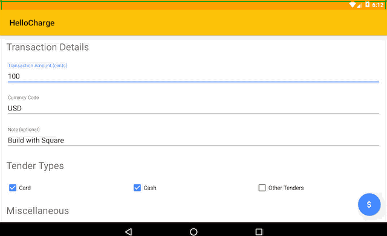

# Point of Sale Android SDK

The Point of Sale Android SDK lets you quickly build custom Android point-of-sale applications that take swipe, dip, or tap payments through Square hardware.

[Get started](http://docs.connect.squareup.com/articles/register-api-android/)!

## Need help?

Here's [how to get help](https://developer.squareup.com/forums/).

## Building the Hellocharge Sample App

The hellocharge app is available in the `sample-hellocharge` folder.

Check out this repo:

```
git clone https://github.com/square/point-of-sale-android-sdk.git
cd point-of-sale-android-sdk
```

Create a `hellocharge.properties` file in the `sample-hellocharge` folder, with a `clientId` key set to your application's client id which is the same as your application id in the Square Developer Portal (`sq0idp-XXXXXXXXXXXXXXX`). Do *NOT* use a sandbox `clientId`, as those do not work for the Point of Sale API.

```
echo clientId=\"put your production clientId here\" > sample-hellocharge/hellocharge.properties
```

And also create a `bikeshop.properties` file in the `sample-bikeshop` folder, with a `clientId` key set to your application's client id which is the same as your application id in the Square Developer Portal (`sq0idp-XXXXXXXXXXXXXXX`). Do *NOT* use a sandbox `clientId`, as those do not work for the Point of Sale API.

```
echo clientId=\"put your production clientId here\" > sample-bikeshop/bikeshop.properties
```

Build the SDK and the sample app:

```
./gradlew :sample-hellocharge:build
```

Add the [SHA1 fingerprint](https://docs.connect.squareup.com/articles/android-app-fingerprint/) of the sample app to your application dashboard:

```
keytool -printcert -jarfile ./sample-hellocharge/build/outputs/apk/debug/sample-hellocharge-debug.apk
```

Install the sample app:

```
./gradlew :sample-hellocharge:installDebug
```



## Bikeshop Sample App

The bikeshop is an example of a real point-of-sale application, available in the `sample-bikeshop` folder. To build this sample app, follow the same instructions as above, substituting "hellocharge" for "bikeshop".

## Feedback
Rate the sample apps [here](https://delighted.com/t/Z1xmKSqy)!

## Contributing

Contributions are welcome! Please read our [contributing guidelines](.github/CONTRIBUTING.md).

## License

    Copyright 2016 Square, Inc.

    Licensed under the Apache License, Version 2.0 (the "License");
    you may not use this file except in compliance with the License.
    You may obtain a copy of the License at

       http://www.apache.org/licenses/LICENSE-2.0

    Unless required by applicable law or agreed to in writing, software
    distributed under the License is distributed on an "AS IS" BASIS,
    WITHOUT WARRANTIES OR CONDITIONS OF ANY KIND, either express or implied.
    See the License for the specific language governing permissions and
    limitations under the License.
